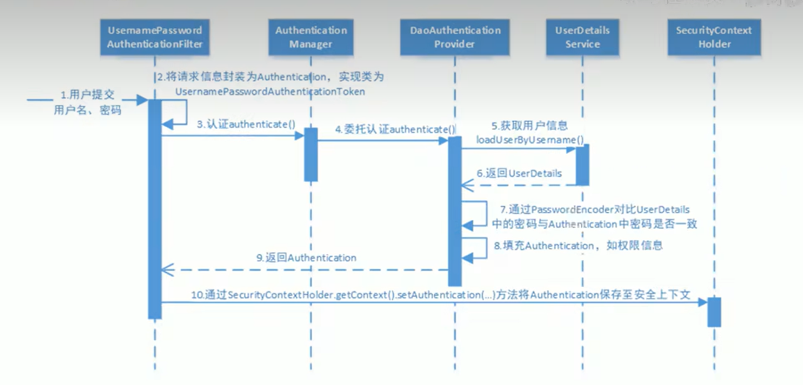
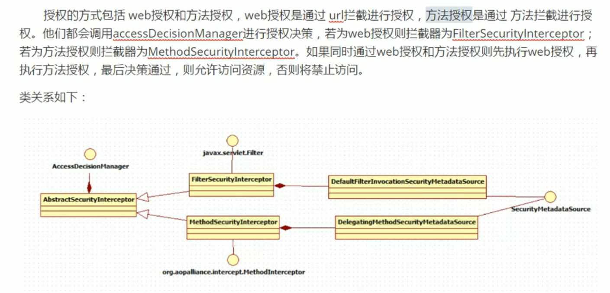

### 认证流程


### 过滤链中主要的几个过滤器及其作用： 
<b>SecurityContextPersistenceFilter</b>:是整个拦截过程的入口和出口 负责初始化一些环境。

<b>UsernamePasswordAuthenticationFilter</b>:
处理来自表单提交的认证。该表单必须提供对应的账号密码，其内部还有登录成功或失败后进行处理
的 AuthenticationSuccessHandler 和 AuthenticationFailureHandler,这些都可以根据
需要做相关改变。

<b>FilterSecurityInterceptor</b>: 保护web资源，使用 AccessDecisionManager 对当前用户进行
授权访问 。

<b>ExceptionTranslationFilter</b>: 能捕获来自 FilterChain 所有的异常，并进行处理。只会处理两类
异常：AuthenticationException 和 AccessDeniedException,其他异常会继续抛出。

### 会话控制
> 我们可以通过以下选项准确控制会话何时创建以及Spring-security如何与之交互。

|机制 | 描述|
|:--:|:--:|
|always |如果没有session, 就创建一个|
|ifRequired | 如果需要就创建一个 Session(<b>默认</b>)登录时 |
|never |Spring Security 将不会创建 Session,但是如果应用中其他地方创建了Session,Spring Security将会使用它|
|stateless | Spring Security 将绝对不会创建Session，也不使用Session|

### 会话超时
> 可以在 Servlet 容器中设置 Session 的超时时间，如下设置 Session 有效期为 3600s;
###
Spring Boot 配置文件:<br/>
```server.servlet.session.timeout=3600s```

Session 超时之后，可以通过Spring Security 设置跳转路径：<br/>
``` http.sessionManagement()
    .expireUrl("/login-view?error=EXPIRED_SESSION")
   .invalidSessionUrl("/login-view?error=INVALIAD_SESSION");
```

expired 指 Session 过期，invalidSession 指传入的 sessionid 无效。

### 安全会话
> 我们可以使用 HttpOnly 和 Secure 标签来保护会话 Cookie:
###
* httpOnly: 如果为 true, 浏览器脚本将无法访问 Cookie
* secure: 如果为 true, cookie 将仅通过 HTTPS 连接发送

SpringBoot 配置文件:<br/>
``` server.servlet.session.cookie.http-only=true
    server.servlet.sesion.cookie.secure=true
```

### 授权流程

 
### 授权方式
* web授权
* method授权
